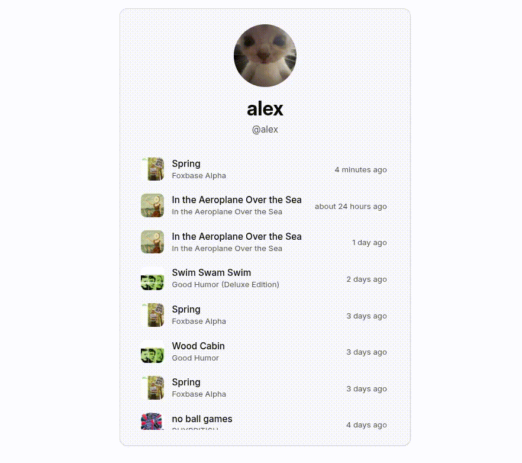

# my.fm

my.fm is a little [last.fm](https://last.fm) clone. It can be trivially self
hosted and can support an unknown amount of users (I'm not sure how many, it
may get rate limited by Spotify after a certain number of users)

## Stack

On the fronend, my.fm uses [React 19](https://react.dev). For the design
system, [Tailwind](https://tailwindcss.com) with [9ui](https://www.9ui.dev/)
components (which in turn use [Base UI](https://base-ui.com/)) is used. For
routing, we use [React Router](https://reactrouter.com).

On the backend, we have a simple [Hono](https://hono.dev) API that runs on Bun
and uses SQLite through [Drizzle](https://orm.drizzle.team/). Authentication is
offloaded to [Better Auth](https://better-auth.com)

## Demo

(I'll set up a hosted instance of it soon)

Here's what it looks like!

